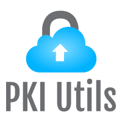

<!-- PROJECT SHIELDS -->
[![Build Status][build-shield]]()
[![Contributors][contributors-shield]]()
[![MIT License][license-shield]][license-url]
[![LinkedIn][linkedin-shield]][linkedin-url]


<!-- PROJECT LOGO -->
<br />
<p align="center">
  <a href="https://github.com/tonycavella/pkiutils">
    
  </a>

  <h3 align="center">PKI Utils</h3>

  <p align="center">
    Collection of BASH based PKI utilities to assist with administration and maintenance of enterprise PKI systems.
    <br />
    <a href="https://github.com/tonycavella/pkiutils"><strong>Explore the docs »</strong></a>
    <br />
    <br />
    <a href="https://github.com/tonycavella/pkiutils">View Demo</a>
    ·
    <a href="https://github.com/tonycavella/pkiutils/issues">Report Bug</a>
    ·
    <a href="https://github.com/tonycavella/pkiutils/issues">Request Feature</a>
  </p>
</p>


<!-- TABLE OF CONTENTS -->
## Table of Contents

* [About the Project](#about-the-project)
  * [Built With](#built-with)
* [Getting Started](#getting-started)
  * [Prerequisites](#prerequisites)
  * [Installation](#installation)
* [Usage](#usage)
* [Contributing](#contributing)
* [License](#license)
* [Contact](#contact)
* [Acknowledgements](#acknowledgements)


<!-- ABOUT THE PROJECT -->
## About The Project

[![Product Name Screen Shot][product-screenshot]](https://example.com)

PKIUtils is a collection of tools to aid in the administration, maintenance and upkeep of an enterprise PKI system.  Although designed with an enterprise PKI system in mind, PKIUtils will also assist with many everyday PKI related functions at the user level as well.  

Here's why:
* OpenSSL is extremely powerful tool with an overwelming number of options and commands.
* PKIUtils leverages OpenSSL and simplifies its operation.
* PKIUtils can be set to automate routine functions.

### Built with
* [BASH](https://www.gnu.org/software/bash/) - Bash is an sh-compatible shell that incorporates useful features from the Korn shell (ksh) and C shell (csh). It is intended to conform to the IEEE POSIX P1003.2/ISO 9945.2 Shell and Tools standard.
* [curl](https://curl.haxx.se/) - 
* [OpenSSL](https://openssl.org) - 


<!-- GETTING STARTED -->
## Getting Started

This is an example of how you may give instructions on setting up your project locally.
To get a local copy up and running follow these simple example steps.

### Prerequisites

This is an example of how to list things you need to use the software and how to install them.
* npm
```sh
npm install npm@latest -g
```

### Installation

1. Get a free API Key at [https://example.com](https://example.com)
2. Clone the repo
```sh
git clone https:://github.com/your_username_/Project-Name.git
```
3. Install NPM packages
```sh
npm install
```
4. Enter your API in `config.js`
```JS
const API_KEY = 'ENTER YOUR API';
```


<!-- USAGE EXAMPLES -->
## Usage

Use this space to show useful examples of how a project can be used. Additional screenshots, code examples and demos work well in this space. You may also link to more resources.

_For more examples, please refer to the [Documentation](https://example.com)_


<!-- CONTRIBUTING -->
## Contributing

Contributions are what make the open source community such an amazing place to be learn, inspire, and create. Any contributions you make are **greatly appreciated**.

1. Fork the Project
2. Create your Feature Branch (`git checkout -b feature/AmazingFeature`)
3. Commit your Changes (`git commit -m 'Add some AmazingFeature`)
4. Push to the Branch (`git push origin feature/AmazingFeature`)
5. Open a Pull Request


<!-- LICENSE -->
## License

Distributed under the MIT License. See `LICENSE` for more information.


<!-- CONTACT -->
## Contact

Tony Cavella - tony@cavella.com

Project Link: [https://github.com/tonycavella/pkiutils](https://github.com/tonycavella/pkiutils)


<!-- ACKNOWLEDGEMENTS -->
## Acknowledgements
* [GitHub Emoji Cheat Sheet](https://www.webpagefx.com/tools/emoji-cheat-sheet)
* [Img Shields](https://shields.io)
* [Choose an Open Source License](https://choosealicense.com)
* [GitHub Pages](https://pages.github.com)
* [Animate.css](https://daneden.github.io/animate.css)
* [Loaders.css](https://connoratherton.com/loaders)
* [Slick Carousel](https://kenwheeler.github.io/slick)
* [Smooth Scroll](https://github.com/cferdinandi/smooth-scroll)
* [Sticky Kit](http://leafo.net/sticky-kit)
* [JVectorMap](http://jvectormap.com)
* [Font Awesome](https://fontawesome.com)


<!-- MARKDOWN LINKS & IMAGES -->
[build-shield]: https://img.shields.io/badge/build-passing-brightgreen.svg?style=flat-square
[contributors-shield]: https://img.shields.io/badge/contributors-1-orange.svg?style=flat-square
[license-shield]: https://img.shields.io/github/license/tonycavella/pkiutils.svg?style=flat-square
[license-url]: https://choosealicense.com/licenses/gpl-3.0/
[linkedin-shield]: https://img.shields.io/badge/-LinkedIn-black.svg?style=flat-square&logo=linkedin&colorB=555
[linkedin-url]: https://linkedin.com/in/anthonycavella
[product-screenshot]: https://raw.githubusercontent.com/othneildrew/Best-README-Template/master/screenshot.png
